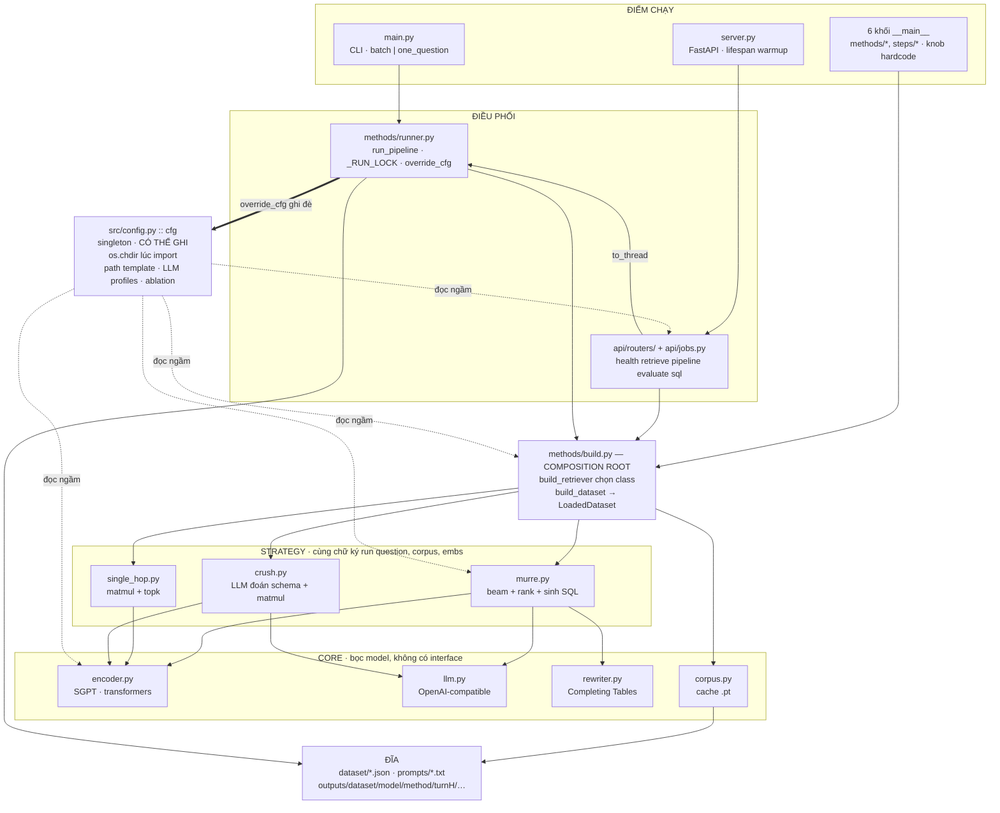
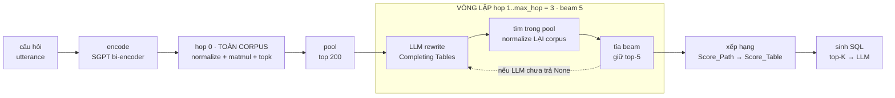
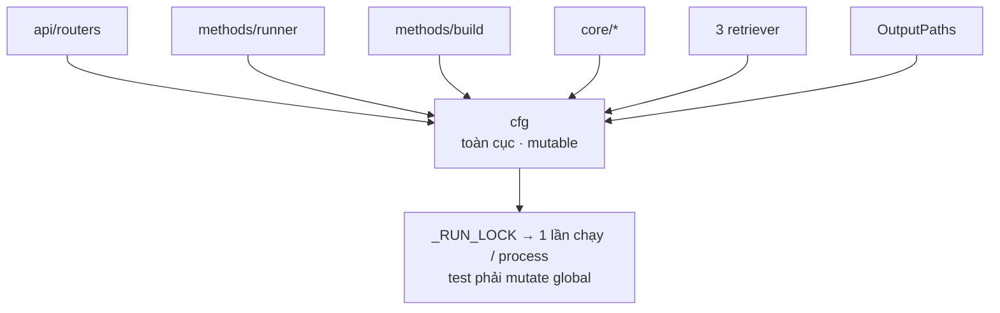
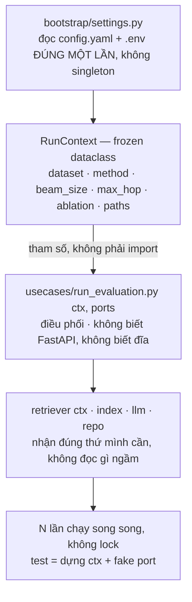
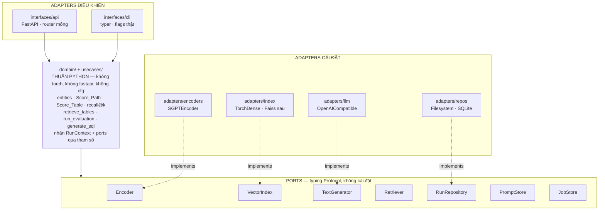

# Kiến trúc MURRE

> Rà soát kiến trúc — 01/09/2026
> Đọc từ commit `f4d3c08` trên nhánh `main`.
> 38 file `.py` · 3.872 dòng trong `src/` và `dataset/` · 3 method · 5 endpoint · 8 điểm chạy · **0 test**

Bản đồ codebase hiện tại, mười điểm nghẽn đọc ra được từ code, và lộ trình refactor
sang *ports & adapters* theo từng bước giữ nguyên chương trình chạy được.

---

## Mục lục

1. [Bản đồ codebase](#1-bản-đồ-codebase)
2. [Sáu thứ đã làm đúng](#2-sáu-thứ-đã-làm-đúng)
3. [Một câu hỏi MURRE tốn những gì](#3-một-câu-hỏi-murre-tốn-những-gì)
4. [Mười điểm nghẽn](#4-mười-điểm-nghẽn)
5. [Thay đổi cốt lõi: từ `cfg` toàn cục sang `RunContext`](#5-thay-đổi-cốt-lõi-từ-cfg-toàn-cục-sang-runcontext)
6. [Kiến trúc đích: Ports & Adapters bản gọn](#6-kiến-trúc-đích-ports--adapters-bản-gọn)
7. [Lộ trình theo kiểu strangler](#7-lộ-trình-theo-kiểu-strangler)
8. [Năm thứ đừng làm](#8-năm-thứ-đừng-làm)

---

## 1. Bản đồ codebase

Về hình dáng, MURRE là một **layered monolith** khá gọn: hai điểm chạy chính (CLI và
HTTP), một tầng điều phối, một composition root duy nhất, ba strategy retrieval sau
cùng một chữ ký, và một tầng adapter bọc model. Đường phụ thuộc đi một chiều xuống —
đúng như sách.

Thứ không nằm trong tầng nào mới là thứ quyết định: `cfg`, một singleton *có thể ghi*,
được mọi tầng đọc ngầm và bị tầng điều phối ghi đè ngay trong lúc chạy.



**Cách đọc sơ đồ.** Bốn mũi tên **nét đứt** = tầng đó `import cfg` rồi đọc ngầm,
không nhận qua tham số. Mũi tên **đậm** = `runner.override_cfg()` ghi đè
`cfg.general.dataset` và `cfg.pipeline.method` trong suốt một lần chạy. Hai chiều mũi
tên này gặp nhau chính là lý do phải có `_RUN_LOCK`.

---

## 2. Sáu thứ đã làm đúng

Trước khi bàn refactor: phần lớn kiến trúc ở đây đã đúng, và một số quyết định còn tốt
hơn mức trung bình của repo research.

| | Đã làm đúng | Chi tiết |
|---|---|---|
| 1 | **Một composition root duy nhất** | `methods/build.py` là chỗ duy nhất biết cách ráp bộ retrieval. CLI và API dùng chung, khác nhau chỉ ở chỗ ai sở hữu encoder/LLM. |
| 2 | **Strategy sau một chữ ký** | Ba method dùng đúng một `run(question, corpus, schema_embeddings)`, nên tầng trên không cần biết đang chạy method nào. |
| 3 | **Không có metric drift** | `/pipeline` đọc lại điểm bằng đúng đường code của `/evaluate`. Hai endpoint không thể lệch số — chi tiết ít repo nào nghĩ tới. |
| 4 | **Cache có kiểm tra nhất quán** | `load_embeddings()` so số vector với số schema và nổ ngay nếu lệch, thay vì chấm điểm sai âm thầm. |
| 5 | **Enum thay chuỗi trần** | `Dataset`, `Method`, `JobStatus` kèm `_missing_` khoan dung và `values()` để in vào thông báo lỗi. |
| 6 | **Async job + progress callback** | Việc nặng đẩy sang thread, trả `202` + `job_id` để poll. Đúng pattern cho pipeline chạy 1,6 giờ. |

---

## 3. Một câu hỏi MURRE tốn những gì

Sơ đồ tầng không cho thấy giá phải trả. Vẽ đường đi thật của một câu hỏi thì hai con
số hiện ra: số lượt gọi LLM, và số lần chuẩn hoá lại toàn bộ corpus.



Hai khoản chi phí mà kiến trúc hiện tại đang trả nhưng **không cần trả**:

- **5 beam × 3 hop → tối đa 15 lượt gọi LLM cho MỘT câu hỏi**, cộng 1 lượt sinh SQL.
- **`F.normalize()` chạy lại trên toàn bộ vector corpus ở mỗi lượt retrieve** — 16 lượt
  mỗi câu — dù vector corpus không hề đổi giữa các hop.

Đo trên máy này: `single_hop` ~2,7 phút / 658 câu, còn `murre` ~1,6 giờ. Chênh lệch
nằm gần hết ở 15 lượt LLM đó.

---

## 4. Mười điểm nghẽn

Xếp theo mức chặn đường: **CHẶN** là thứ khoá các thay đổi khác lại, **CAO** là thứ sẽ
đắt dần theo thời gian, **VỪA** là nợ kỹ thuật gọn.

### 01 — `cfg` toàn cục có thể ghi là trạng thái dùng chung của cả process · `CHẶN`

`override_cfg()` ghi đè `dataset` và `method` trên biến toàn cục suốt một lần chạy, nên
phải có `_RUN_LOCK` để chỉ cho một lần chạy tồn tại — và `/retrieve` gọi trong lúc đó
sẽ thấy dataset đã bị đổi. Đây là điểm gãy trung tâm: nó chặn chạy song song, chặn
scale ngang, và làm test nào cũng phải mutate global.

> `src/config.py:432` · `src/methods/runner.py:35,44` · `src/api/routers/pipeline.py` (409)

### 02 — `max_tokens=100` cứng trong `LLMGenerator.generate()` · `CHẶN`

Cùng một hàm phục vụ hai việc có nhu cầu khác nhau: rewrite cần ~100 token, sinh SQL
thì không. Câu SQL dài hơn ~100 token sẽ bị cắt giữa câu mà không có dấu hiệu gì trong
log. Đây là *config leak* — một tham số của call-site bị đóng đinh trong adapter.

> `src/core/llm.py` · dùng bởi `core/rewriter.py`, `methods/murre.py::build_sql`, `steps/infer.py`

### 03 — Không có interface cho retriever, thêm method phải sửa ba chỗ · `CAO`

`RetrieverType = Union[...]`, `match method:`, và `Method.needs_llm` là ba chỗ phải sửa
đồng bộ cho mỗi method mới. Chữ ký chung đang được giữ bằng duck typing và một dòng
docstring, không có gì kiểm tra.

> `src/methods/build.py:32,78` · `src/enums.py` (`Method.needs_llm`)

### 04 — Retriever phụ thuộc class cụ thể, không phải port · `CAO`

`MurreRetriever.__init__` nhận đúng `SGPTEncoder` và `LLMGenerator`. Muốn thử BGE, E5
hay một reranker cross-encoder là phải sửa vào `methods/` — nơi lẽ ra chỉ chứa thuật
toán của paper.

> `src/methods/murre.py` · `single_hop.py` · `crush.py`

### 05 — Tìm kiếm vector viết tay, lặp ba lần, chuẩn hoá lại corpus mỗi lượt · `CAO`

Bộ ba `F.normalize → matmul → topk` xuất hiện y nguyên ở `single_hop.run`, `crush.run`
và `murre._retrieve`. Trong đó `normalize(schema_embeddings)` chạy lại toàn bộ corpus ở
*mỗi* lượt gọi, tức 16 lượt cho một câu MURRE, dù vector corpus không hề đổi.

Không có khái niệm *index*: lọc `pool` đang là việc của code method thay vì của tầng
tìm kiếm.

> `src/methods/single_hop.py:31` · `crush.py:104` · `murre.py::_retrieve()`

### 06 — Prompt không có nhà, `build_sql` phải import hàm private xuyên tầng · `CAO`

`methods/murre.py::build_sql()` import `_ZERO_SHOT_PROMPT` và `_build_table_prompt` từ
`steps/infer.py` *trong thân hàm* để né circular import. Đó là dấu hiệu rõ nhất của một
module còn thiếu: prompt building.

Cùng lúc, `murre.py` gánh ba việc — beam search, xếp hạng, và sinh SQL — trong đó việc
thứ ba không thuộc về một retriever.

> `src/methods/murre.py` (`build_sql`) → `src/steps/infer.py` (`_ZERO_SHOT_PROMPT`)

### 07 — Không có manifest, hai lần chạy khác cấu hình ghi đè lẫn nhau · `CAO`

Đường dẫn output chỉ được khoá theo `{dataset}/{model}/{method}/turn{max_hop}`. Còn
`beam_size`, `top_k_pool`, ba cờ ablation (`removal`, `tabulation`, `early_stop`) và
LLM profile thì **không** nằm trong khoá. Chạy beam 5 rồi chạy beam 10 là mất kết quả
cũ, im lặng.

Với một repo mà đầu ra *chính là* con số recall, đây là lỗ hổng reproducibility lớn nhất.

> `src/config.py:141` (`PathsConfig`) · `src/methods/runner.py::_run_locked()`

### 08 — `tests/` rỗng · `CAO`

Không có golden set, không có snapshot cho prompt builder, không có gì chặn regression
recall. Mọi refactor bên dưới đều cần lưới an toàn này trước — nên nó là bước đầu tiên
của lộ trình, không phải bước cuối.

> `tests/` (0 file)

### 09 — FastAPI rò xuống dưới biên API · `VỪA`

`api/evaluator.py` raise `HTTPException` dù docstring nói nó dùng được trực tiếp từ
script. `api/jobs.py` thì catch `HTTPException` để đổi thành text. Trong khi đó
`models/errors.py::AppError` đã tồn tại và đang bị dùng nửa vời.

> `src/api/evaluator.py` (404/400/409) · `src/api/jobs.py` · `src/models/errors.py`

### 10 — `os.chdir()` chạy lúc import, và tham số chạy nằm trong source · `VỪA`

`config.py` đổi cwd của cả process ngay khi được import — nên uvicorn buộc phải khởi
động từ `src/`, và bất cứ ai import `config` đều bị đổi cwd theo.

Cùng nhóm: `QUESTION`, `TOP_N`, `LIMIT`, `FORCE_EMBED` là biến hardcode trong `main.py`
và trong sáu khối `__main__` — đổi tham số chạy phải sửa source, nên không có câu lệnh
nào tái lập được một lần chạy.

> `src/config.py:37` · `src/main.py:20-45` · `methods/*.py __main__`

### Ba thứ nhỏ hơn, ghi lại để không quên

- Encoder PyTorch trong `app.state` được nhiều `asyncio.to_thread` dùng chung, không có lock.
- Job chỉ nằm trong RAM nên restart là mất lịch sử.
- `steps/embed.py` giờ chỉ còn là wrapper mỏng quanh `core/corpus.prepare()`.

---

## 5. Thay đổi cốt lõi: từ `cfg` toàn cục sang `RunContext`

Nếu chỉ làm được một việc, làm việc này. Mọi hạn chế còn lại — một job mỗi lần, không
test được, không chạy song song hai dataset — đều là hệ quả của cùng một hình sao.

### Hiện tại — hình sao



### Đề xuất — truyền tường minh



Thay đổi thật chỉ là một chữ: `cfg` đi từ **biến module** thành **tham số**. Sáu mũi
tên hình sao biến thành một chuỗi thẳng, và `override_cfg()` cùng `_RUN_LOCK` không còn
lý do tồn tại.

---

## 6. Kiến trúc đích: Ports & Adapters bản gọn

Đích **không phải** Clean Architecture đủ bốn tầng — repo research không cần và sẽ không
chịu nổi chi phí đó. Đích là *hexagonal-lite*: một lõi thuần Python, một vành hợp đồng
bằng `Protocol`, và mọi thứ chạm vào thế giới bên ngoài đều là adapter cắm vào.



Mọi mũi tên chỉ **vào trong**. Lõi không import bất cứ thứ gì ở vành ngoài, nên test
được bằng fake port và không cần GPU. `bootstrap/container.py` là chỗ duy nhất biết
adapter nào cắm vào port nào — đúng vai trò mà `methods/build.py` đang giữ.

### Cây thư mục đề xuất

Phần đánh dấu `[MỚI]` là module mới; phần còn lại là code hiện có được **dời chỗ**, gần
như không sửa logic.

```
src/
├── domain/                  # thuần Python — không torch, không fastapi, không cfg
│   ├── entities.py          # Schema, RetrievedTable, BeamPath, ResultRecord
│   ├── scoring.py           # normalize(), path_score(), score_table()  ← utils/scoring.py
│   ├── metrics.py           # recall@k, complete_recall@k               ← utils/metrics.py
│   └── errors.py            # DomainError — KHÔNG có HTTPException      ← models/errors.py
├── ports/                   # [MỚI] typing.Protocol — hợp đồng, không cài đặt
│   ├── encoder.py           # encode(texts, is_query) -> Vectors
│   ├── index.py             # search(queries, k, pool) -> list[Hit]
│   ├── llm.py               # generate(prompt, max_tokens, temperature) -> str
│   ├── retriever.py         # run(question, ctx) -> list[RetrievedTable]
│   └── repositories.py      # CorpusRepo · RunRepo · PromptStore · JobStore
├── adapters/
│   ├── encoders/sgpt.py     # ← core/encoder.py, gần như y nguyên
│   ├── llm/openai_compat.py # ← core/llm.py + max_tokens theo call-site
│   ├── index/torch_dense.py # [MỚI] normalize corpus MỘT LẦN lúc build, gộp 3 bản matmul
│   ├── repos/filesystem.py  # ← phần json.dump/makedirs trong runner._run_locked()
│   └── prompts/file_store.py# [MỚI] ← _ZERO_SHOT_PROMPT, _build_table_prompt của steps/infer.py
├── retrievers/              # thuật toán của paper, chỉ phụ thuộc ports/
│   ├── registry.py          # [MỚI] @register(Method.X) — thay match/case trong build.py
│   ├── murre/search.py      # beam search        ← murre.py phần _retrieve + run
│   ├── murre/ranking.py     # Score_Table        ← murre.py phần _rank
│   ├── single_hop.py
│   └── crush.py
├── usecases/
│   ├── retrieve_tables.py   # dùng cho cả /retrieve và một câu trên CLI
│   ├── run_evaluation.py    # ← runner.run_pipeline, bỏ lock và override_cfg
│   └── generate_sql.py      # ← murre.build_sql + steps/infer.run_infer
├── bootstrap/
│   ├── settings.py          # ← config.py, BỎ singleton cfg và os.chdir()
│   ├── context.py           # [MỚI] RunContext (frozen) + run_id = hash(cấu hình)
│   └── container.py         # ← methods/build.py, nay ráp cả adapter cho port
└── interfaces/
    ├── cli/                 # [MỚI] typer — thay main.py và 6 khối __main__
    └── api/                 # ← api/, router mỏng: parse → usecase → schema
```

---

## 7. Lộ trình theo kiểu strangler

Không có bước nào ở đây đòi dừng chương trình lại. Mỗi bước là một thay đổi cơ học,
chạy được ngay sau khi làm, và `P0.1` là lưới an toàn cho tất cả những bước sau.

**Cỡ:** `S` nửa ngày · `M` một đến hai ngày · `L` vài ngày — giả định bạn đã quen codebase này.

### P0 — Mở khoá
*Làm trước, vì mọi thứ khác phụ thuộc.*

| # | Việc | Cỡ | Mở khoá được gì |
|---|---|---|---|
| 0.1 | Golden set 30 câu + `pytest` chặn regression `recall@5` và `complete_recall@5`; snapshot cho prompt builder. | `M` | Lưới an toàn cho mọi bước sau. Không có bước này thì refactor là đánh cược. |
| 0.2 | Bỏ `os.chdir()` lúc import; đường dẫn resolve từ `PROJECT_ROOT` trong chính hàm dựng path. | `S` | Chạy uvicorn từ gốc repo; import `config` không còn đổi cwd của process. |
| 0.3 | `max_tokens` thành tham số của `generate()` + mặc định theo profile: rewrite 100, SQL 512. | `S` | Hết rủi ro SQL bị cắt giữa câu. |
| 0.4 | `RunContext` frozen thay `cfg` trên toàn đường chạy; `cfg` chỉ còn sống ở `bootstrap/`. Xoá `override_cfg()` và `_RUN_LOCK`. | **`L`** | Chạy song song nhiều dataset/method; test không cần mutate global; `/retrieve` không còn bị lệch dataset khi có job. |

### P1 — Dựng biên
*Nơi thu về nhiều nhất trên mỗi giờ bỏ ra.*

| # | Việc | Cỡ | Mở khoá được gì |
|---|---|---|---|
| 1.1 | `Protocol` cho `Encoder`, `TextGenerator`, `VectorIndex`, `Retriever`; retriever nhận port thay vì class cụ thể. | `M` | Đổi encoder (BGE, E5) hoặc thêm reranker mà không chạm vào thuật toán paper. |
| 1.2 | `@register(Method.X)` thay `match/case`; bỏ `RetrieverType = Union[...]` và `Method.needs_llm`. | `S` | Thêm method mới = thêm một file, không sửa file nào khác. |
| 1.3 | `TorchDenseIndex`: chuẩn hoá corpus một lần lúc build, `search(queries, k, pool)` dùng chung cho ba method. | `M` | Xoá ba bản matmul trùng nhau; bỏ 16 lượt normalize toàn corpus mỗi câu MURRE. |
| 1.4 | Module `prompts/` riêng; tách `murre.py` thành `search.py` + `ranking.py`, đưa `generate_sql` lên usecase. | `M` | Hết import hàm private xuyên tầng; retriever chỉ còn làm việc retrieve. |
| 1.5 | `RunRepository` + `manifest.json` mỗi lần chạy (cấu hình đã resolve, git sha, thời gian, model); `run_id = hash(cấu hình)` vào đường dẫn output. | `M` | Hai lần chạy khác `beam_size`/ablation không còn ghi đè nhau; mỗi con số recall truy được về đúng cấu hình sinh ra nó. |

### P2 — Dọn nốt
*Làm khi đã cần, không làm trước.*

| # | Việc | Cỡ | Mở khoá được gì |
|---|---|---|---|
| 2.1 | `DomainError` ở dưới, router map sang HTTP ở trên; `evaluator` bỏ `import fastapi`. | `S` | Dùng lại được evaluator trong script và notebook đúng như docstring đang hứa. |
| 2.2 | CLI `typer` có flags thật; xoá knob hardcode trong `main.py` và sáu khối `__main__`. | `M` | Một lần chạy = một câu lệnh dán được vào log, script được, sweep được. |
| 2.3 | `JobStore` port + adapter SQLite; cho phép N job song song (đã khả thi sau 0.4). | `M` | Restart không mất lịch sử; chạy so sánh ba method cùng lúc. |
| 2.4 | `FaissIndex` cắm vào `VectorIndex` — chỉ khi corpus vượt ~50k schema. | `M` | Không phải sửa gì ngoài một dòng trong container. |

---

## 8. Năm thứ đừng làm

Refactor sai hướng đắt hơn không refactor. Đây là những đường mà bản đề xuất trên *cố ý*
không đi.

**✗ Đừng dựng đủ bốn tầng Clean Architecture.**
Repo này có ba method và một loại nghiệp vụ. Thêm tầng `interactor`, DTO mapper hai
chiều, DI container động là mua chi phí mà không mua được gì. Hexagonal-lite:
`domain` + `ports` + `adapters` là đủ và dừng ở đó.

**✗ Đừng thêm vector DB bây giờ.**
Spider có cỡ nghìn schema; `matmul` dày trên CPU vẫn nhanh hơn overhead của một ANN
index, và nút cổ chai thật là 15 lượt gọi LLM chứ không phải phép nhân ma trận. Thứ cần
dựng là cái *port*, để hôm nào corpus lớn lên thì đổi adapter — không phải cái DB.

**✗ Đừng tách microservice.**
Encoder và LLM đã là process riêng (HuggingFace local, Ollama qua HTTP). Cắt tiếp chỉ
thêm một chặng mạng vào giữa vòng lặp beam.

**✗ Đừng bỏ pydantic để về argparse thuần.**
Cái sai của `config.py` là *singleton có thể ghi*, không phải pydantic. Giữ nguyên toàn
bộ class `*Config` và phần validate — chỉ thôi export biến `cfg`.

**✗ Đừng viết abstract base class cho mọi thứ.**
`typing.Protocol` là structural: ba retriever hiện tại đã khớp `Retriever` mà không cần
kế thừa hay sửa một dòng nào. ABC thì bắt phải sửa cả ba.

---

*Vị trí file dẫn theo trạng thái working tree lúc rà soát (commit `f4d3c08`, nhánh `main`).*
