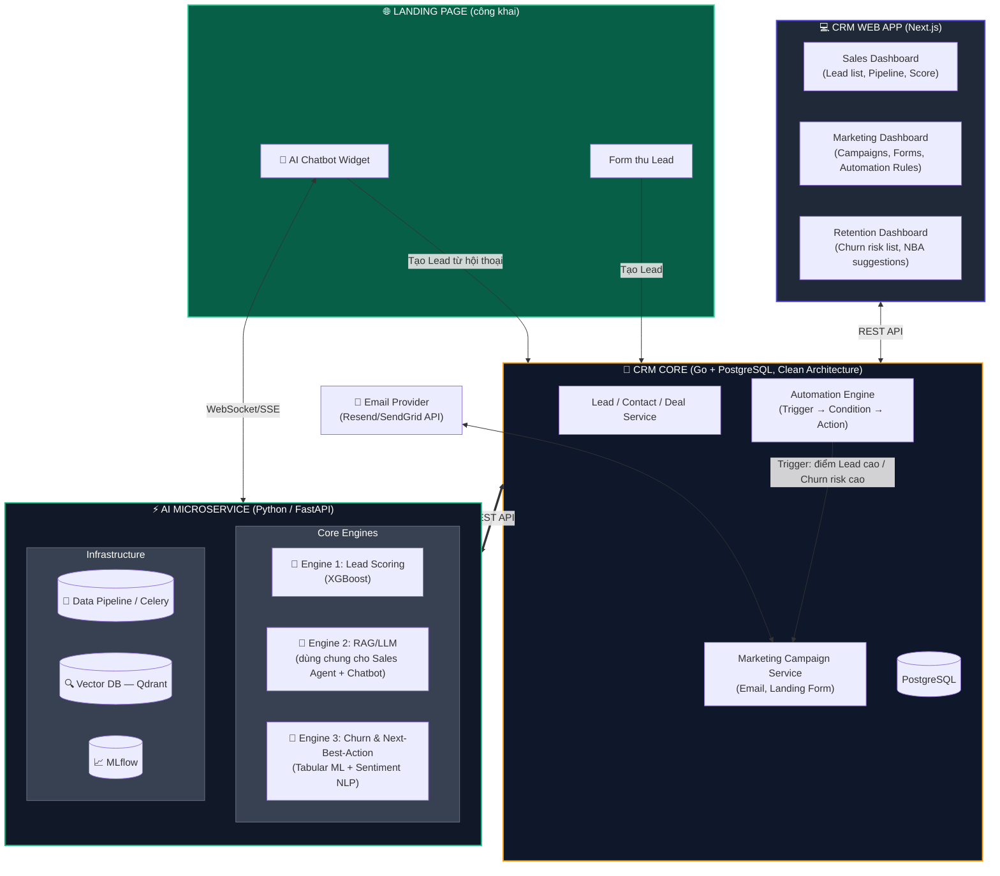

# KẾ HOẠCH BẢO VỆ & THỰC THI LUẬN ÁN THẠC SĨ (v3)

**Chủ đề:** Xây dựng CRM tích hợp AI & Marketing Automation — Tối ưu Vòng đời Khách hàng từ Thu hút Lead đến Giữ chân Khách hàng
**Thời gian thực hiện dự kiến:** 6 tháng (24 tuần) cho phần luận án
**Định hướng sản phẩm:** Xây CRM **mới hoàn toàn**, không dựng trên SuiteCRM/Odoo — dùng nội bộ trước, có lộ trình thương mại hóa (SaaS) sau luận án
**Phương pháp triển khai:** CRM core (Go + PostgreSQL + Web frontend) + AI Microservice (Python/FastAPI) + Marketing Automation Engine + AI Chatbot

---

## 1. TỔNG QUAN BÀI TOÁN & KHUNG ĐÁNH GIÁ KINH DOANH

| Đề tài | Bài toán Vận hành | Giải pháp Tích hợp AI | Chỉ số Kinh doanh Đánh giá (KPIs) |
|---|---|---|---|
| **Đề tài 2: CRM (Sales)** | Mất thời gian vào Lead rác, phản hồi chậm làm giảm tỷ lệ chốt đơn. | Predictive Lead Scoring + AI Sales Agent (RAG/LLM) hỗ trợ phản hồi + **AI Chatbot công khai trên Landing Page**. | • Tỷ lệ chuyển đổi Lead (Conversion Rate) • Thời gian chu kỳ bán hàng (Sales Cycle) • Năng suất phản hồi của Sales • Tỷ lệ chatbot tự thu Lead thành công |
| **Đề tài 3: CRM (Retention)** | Khách hàng rời bỏ không báo trước, chi phí tìm khách mới cao. | Churn Prediction (ML/NLP) + Tự động gợi ý & thực thi kịch bản giữ chân (Next-Best-Action). | • Tỷ lệ rời bỏ (Churn Rate) • Giá trị vòng đời (Customer Lifetime Value) • ROI chiến dịch giữ chân |

**Hai vai trò của AI RAG/LLM trong hệ thống (dùng chung 1 engine, 2 kênh):**
- **Kênh nội bộ (Sales Agent):** Sales nhận Lead → AI tra cứu FAQ/lịch sử tương tác → gợi ý câu trả lời để Sales gửi nhanh hơn.
- **Kênh công khai (AI Chatbot trên Landing Page):** Khách truy cập landing page → chat trực tiếp với chatbot để hỏi thông tin sản phẩm → chatbot **tự thu thập thông tin Lead ngay trong hội thoại** (tên, email, nhu cầu) → tự động tạo Lead + gọi Lead Scoring chấm điểm **ngay lúc hội thoại đang diễn ra** → nếu điểm cao, Automation Engine tự động báo real-time cho Sales tiếp quản hội thoại.

**Vai trò của Marketing Automation Engine (xuyên suốt cả 2 đề tài):**
Đây là phần biến hệ thống từ "công cụ phân tích" thành "công cụ vận hành thật":
- Lead vào hệ thống qua **Chatbot** hoặc **Landing Form** → được Engine Lead Scoring (Đề tài 2) chấm điểm ngay → nếu điểm cao, Automation Engine **tự động** gán cho Sales + gửi email chào mừng.
- Customer có dấu hiệu Churn cao (Đề tài 3) → Automation Engine **tự động** kích hoạt một Email Campaign giữ chân (ví dụ: ưu đãi gia hạn) mà không cần nhân viên phải tự tay gửi.

Nói cách khác: **Lead Scoring & Churn Prediction là bộ não, Chatbot + Automation Engine là tay chân thực thi** — đây là lý do hệ thống dùng được thật ngoài đời chứ không chỉ là dashboard hiển thị số liệu.

---

## 2. KIẾN TRÚC TỔNG QUAN HỆ THỐNG (SYSTEM ARCHITECTURE)

### 2.1. Nguyên tắc thiết kế

- **CRM Core** và **AI Microservice** tách riêng — CRM core gọi AI qua REST API nội bộ, không nhúng logic ML vào code nghiệp vụ.
- **Chatbot dùng chung engine RAG/LLM với Sales Agent** — chỉ khác giao diện hiển thị (widget công khai trên web vs. panel nội bộ cho Sales) và khác quyền truy cập dữ liệu (chatbot công khai không được thấy dữ liệu nội bộ nhạy cảm). Cách này tránh xây 2 hệ thống AI riêng biệt, tiết kiệm đáng kể thời gian.

### 2.2. Đề xuất Tech Stack (dựa trên kinh nghiệm sẵn có của bạn)

| Thành phần | Công nghệ đề xuất | Lý do |
|---|---|---|
| CRM Backend (API, business logic, Automation Engine) | **Go (Gin/Fiber) + GORM + PostgreSQL**, Clean Architecture | Bạn đã có kinh nghiệm dựng Go backend (Family-Tracker) với đúng stack này — tái dùng được pattern, giảm thời gian ramp-up |
| CRM Frontend (Dashboard cho Sales/Marketing) | **Next.js (React) + Tailwind** | Web app hiện đại, dễ demo trước hội đồng, không cần build app di động |
| AI Microservice (Lead Scoring, Churn, RAG/LLM) | **Python + FastAPI** | Hệ sinh thái ML/NLP/RAG mạnh nhất hiện nay, tách biệt hoàn toàn khỏi Go core qua REST |
| AI Chatbot Widget (công khai trên Landing Page) | **Chat widget nhúng (React component) + WebSocket/SSE tới AI Microservice**, dùng chung RAG pipeline với Sales Agent | Không cần xây engine hội thoại riêng — chỉ thêm 1 giao diện chat gọi cùng API RAG/LLM đã có |
| Email/Marketing sending | **Gửi qua provider có sẵn (ví dụ Resend/SendGrid API)** thay vì tự xây SMTP server | Tiết kiệm hàng tuần công sức hạ tầng, tập trung thời gian vào phần AI (trọng tâm luận án) |
| Landing page/Form builder | **Form đơn giản (schema JSON → render động) + Chatbot widget**, KHÔNG xây visual page-builder kéo-thả | Page-builder kéo-thả là bài toán UI lớn, không phải trọng tâm luận án |
| Automation Engine | Bảng `automation_rules` (trigger → condition → action) + Worker chạy nền (Go goroutine hoặc Celery bên Python) | Đơn giản, đủ để chứng minh AI Score → hành động thật |
| Message/Job queue | **Redis** (cho cả Automation Engine trigger và Celery bên AI service) | Nhẹ, dễ triển khai, đủ dùng cho quy mô demo/luận án |

---

## 3. LOẠI DỮ LIỆU & PHƯƠNG PHÁP THỰC NGHIỆM

### Dữ liệu đầu vào

* **Đề tài 2 (CRM Sales):** Vì CRM tự xây, dữ liệu Lead ban đầu sẽ là **dữ liệu bạn tự sinh (seed) hoặc thu thập thật** từ Landing page/Chatbot demo, kết hợp với tập tham chiếu công khai (Marketing Lead Scoring Dataset — Kaggle) để huấn luyện mô hình có đủ số lượng mẫu ban đầu.
* **Chatbot (RAG):** Cần thêm một bộ **tài liệu tri thức** (FAQ sản phẩm, chính sách, câu hỏi thường gặp) để nạp vào Vector DB — đây là dữ liệu bạn cần tự soạn cho demo (không có sẵn tập public phù hợp).
* **Đề tài 3 (CRM Retention):** Dùng dữ liệu Customer sinh ra từ chính các Lead "Won" ở Đề tài 2, bổ sung tập tham chiếu (Telco Churn Dataset / E-commerce Churn Dataset) để có đủ dữ liệu huấn luyện ban đầu.

> **Lưu ý quan trọng:** Vì hệ thống mới xây, sẽ **không có sẵn hàng năm dữ liệu lịch sử thật**. Cách xử lý: huấn luyện mô hình chính trên tập dữ liệu tham chiếu công khai (đủ lớn, đã chuẩn hóa), sau đó **demo trực tiếp trên dữ liệu tự sinh** qua CRM thật (bao gồm hội thoại chatbot thật) để chứng minh tính khả dụng.

### Phương pháp Đánh giá Hiệu quả Kinh doanh

1. **Historical Backtesting** trên tập dữ liệu tham chiếu — đánh giá chất lượng mô hình một cách khách quan.
2. **A/B Testing giả lập** trên dữ liệu tự sinh qua CRM thật (ví dụ: 2 nhóm Lead demo — một nhóm được Chatbot + Automation Engine xử lý tự động, một nhóm xử lý thủ công).
3. **Cost-Benefit Analysis** — tính thêm cả chi phí vận hành thật (email provider, LLM API cost cho chatbot, server hosting).

---

## 4. LỘ TRÌNH THỰC HIỆN 6 THÁNG (24 TUẦN)

⚠️ **Cảnh báo phạm vi:** Khối lượng công việc tăng đáng kể vì phải **tự xây toàn bộ CRM + Marketing Automation Engine + Chatbot** thay vì tái dùng nền tảng có sẵn. Lộ trình dưới đây đã được nén lại tối đa nhưng **rủi ro trễ tiến độ là có thật**. Xem mục 6 để biết phương án cắt giảm nếu cần.

### Giai đoạn 1: Tổng quan & Thiết kế Khái niệm (Tuần 1 – Tuần 3)
* **Tuần 1:** Literature Review — CRM, Marketing Automation, Lead Scoring, Churn Prediction, RAG/LLM, Conversational AI.
* **Tuần 2:** Thiết kế kiến trúc hệ thống, ERD database, xác định phạm vi MVP rõ ràng (xem mục 6).
* **Tuần 3:** Viết và bảo vệ Đề cương nghiên cứu.

### Giai đoạn 2: Xây dựng CRM Core (Tuần 4 – Tuần 9)
* **Tuần 4 - 5:** Dựng CRM backend (Go, Clean Architecture): Lead/Contact/Deal service, database schema, auth.
* **Tuần 6:** Dựng Marketing Campaign Service (gửi email qua provider) + Landing Form Service (form động, thu Lead).
* **Tuần 7:** Dựng Automation Engine (trigger → condition → action) — nền tảng để AI "ra lệnh" được cho hệ thống thật.
* **Tuần 8 - 9:** Dựng CRM frontend (Next.js) — 3 dashboard: Sales, Marketing, Retention. Kết nối API.

### Giai đoạn 3: Thu thập Dữ liệu & Baseline Model (Tuần 10 – Tuần 13)
* **Tuần 10:** Trích xuất/làm sạch tập dữ liệu tham chiếu (Lead Scoring + Churn datasets); soạn bộ tài liệu tri thức cho Chatbot.
* **Tuần 11:** Sinh dữ liệu demo qua chính CRM vừa xây (Lead thật/giả lập qua Landing Form).
* **Tuần 12 - 13:** Xây baseline model cho Lead Scoring và Churn Prediction.

### Giai đoạn 4: Tối ưu Mô hình & Tích hợp AI Microservice (Tuần 14 – Tuần 19)
* **Tuần 14 - 15:**
  * *CRM Sales:* Tối ưu XGBoost/TabNet cho Lead Scoring.
  * *CRM Retention:* Huấn luyện Churn Model (Tabular + Sentiment NLP).
* **Tuần 16:** Cấu hình RAG/LLM pipeline (Vector DB + retrieval) — nền tảng dùng chung cho Sales Agent và Chatbot.
* **Tuần 17:** Xây Chatbot Widget (frontend) + kết nối WebSocket/SSE tới RAG/LLM pipeline; luồng tự tạo Lead từ hội thoại.
* **Tuần 18:** Đóng gói AI Microservice (FastAPI + Docker).
* **Tuần 19:** Tích hợp CRM Core ↔ AI Microservice ↔ Automation Engine — điểm mấu chốt chứng minh "AI thật sự điều khiển hành động".

### Giai đoạn 5: Đánh giá Hiệu quả Kinh doanh (Tuần 20 – Tuần 22)
* **Tuần 20:** Historical Backtesting trên dữ liệu tham chiếu (Technical Metrics: ROC-AUC, F1-score).
* **Tuần 21:** A/B Testing giả lập trên CRM thật (nhóm có Chatbot + Automation vs. nhóm xử lý thủ công).
* **Tuần 22:** Đo lường KPI kinh doanh + Cost-Benefit Analysis (bao gồm chi phí vận hành thật).

### Giai đoạn 6: Hoàn thiện Luận án & Bảo vệ (Tuần 23 – Tuần 24)
* **Tuần 23:** Viết hoàn thiện Chương 4, 5; phản biện thử, chỉnh sửa theo góp ý Giảng viên hướng dẫn.
* **Tuần 24:** Nộp luận án + chuẩn bị Slide/Demo trực tiếp hệ thống (bao gồm demo chat trực tiếp với Chatbot) trước Hội đồng.

---

## 5. BỐ CỤC ĐỀ XUẤT CHO CÁC CHƯƠNG LUẬN ÁN

* **MỞ ĐẦU:** Tính cấp thiết, Mục tiêu nghiên cứu, Đối tượng & Phạm vi (CRM tự xây + AI + Chatbot, có định hướng sản phẩm thật), Đóng góp mới.
* **CHƯƠNG 1: CƠ SỞ LÝ THUYẾT VÀ TỔNG QUAN NGHIÊN CỨU**
  * CRM, Customer Lifecycle Management, Marketing Automation.
  * Thuật toán AI/ML: Classification, NLP/LLM, RAG, Conversational AI/Chatbot.
  * Công trình liên quan trong/ngoài nước.
* **CHƯƠNG 2: THIẾT KẾ GIẢI PHÁP VÀ KIẾN TRÚC HỆ THỐNG**
  * Kiến trúc CRM Core + Automation Engine + AI Microservice + Chatbot (mục 2).
  * Thiết kế database, luồng dữ liệu Lead → Customer → Churn.
  * Thiết kế Automation Engine: trigger/condition/action model.
  * Thiết kế luồng hội thoại Chatbot → tạo Lead → chấm điểm real-time.
* **CHƯƠNG 3: TRIỂN KHAI THỰC NGHIỆM VÀ TÍCH HỢP HỆ THỐNG**
  * Xây dựng CRM (backend, frontend, database).
  * Huấn luyện mô hình AI, đóng gói Microservice.
  * Xây dựng Chatbot Widget và pipeline RAG.
  * Tích hợp Automation Engine với AI outputs.
* **CHƯƠNG 4: KẾT QUẢ THỰC NGHIỆM VÀ ĐÁNH GIÁ HIỆU QUẢ KINH DOANH**
  * Technical Metrics + Business Impact & ROI.
  * **Demo trực tiếp hệ thống thật, bao gồm hội thoại với Chatbot** — điểm khác biệt lớn nhất so với luận án chỉ dùng dữ liệu offline.
* **KẾT LUẬN VÀ HƯỚNG PHÁT TRIỂN**
  * Hướng thương mại hóa (SaaS): multi-tenancy, billing, page-builder kéo-thả đầy đủ, chatbot đa kênh (Zalo, Messenger), mở rộng Đề tài 1 (Inventory) như một module thêm trong tương lai.

---

## 6. QUẢN LÝ RỦI RO — RẤT QUAN TRỌNG VỚI HƯỚNG ĐI NÀY

### 6.1. Rủi ro lớn nhất: khối lượng code tăng vọt
Xây CRM + Automation Engine + Chatbot từ đầu là khối lượng của **một sản phẩm SaaS thật**, thường cần đội 3-5 người làm vài tháng. Một mình làm trong khi vẫn phải nghiên cứu + viết luận án là rủi ro tiến độ thật sự.

**Cách giảm rủi ro — xác định rõ "MVP luận án" ngay từ Tuần 2:**
| Có trong MVP luận án (bắt buộc) | Để dành sau luận án (hướng phát triển) |
|---|---|
| Lead/Contact/Deal CRUD cơ bản | Multi-tenancy (nhiều công ty dùng chung 1 hệ thống) |
| Form thu Lead đơn giản (JSON schema, không kéo-thả) | Visual Landing Page Builder kéo-thả |
| Chatbot cơ bản: hỏi-đáp FAQ + tự tạo Lead qua hội thoại | Chatbot đa kênh (Zalo, Messenger), đa ngôn ngữ, giọng nói |
| Gửi email qua provider có sẵn (1 loại campaign) | Nhiều loại campaign, A/B test email thật, SMS |
| Automation Engine với vài rule cố định (đủ demo AI → hành động) | Automation Engine tổng quát kiểu Zapier, nhiều trigger/action tùy biến |
| 3 dashboard cơ bản (Sales/Marketing/Retention) | UI/UX hoàn thiện mức sản phẩm thương mại, có thể bán |
| Auth đơn giản (1 công ty, nhiều user, phân quyền cơ bản) | Billing, subscription, phân quyền chi tiết theo gói |

### 6.2. Nên trao đổi sớm với Giảng viên hướng dẫn
Về việc phạm vi giờ bao gồm cả xây dựng phần mềm nền tảng + chatbot (không chỉ tích hợp AI) — cần xác nhận cách này vẫn tính đúng trọng tâm luận án Thạc sĩ là **nghiên cứu AI** (Chương 3-4), chứ không bị đánh giá lệch thành "đồ án phần mềm". Gợi ý: nhấn mạnh trong Chương 3 rằng phần CRM Core + Chatbot Widget là "hạ tầng thực nghiệm" (experimental infrastructure) để chứng minh tính khả dụng của giải pháp AI trong môi trường thật — không phải trọng tâm đóng góp khoa học.

### 6.3. Nếu vẫn thấy rủi ro cao khi vào Tuần 8-9
Có phương án dự phòng: quay lại dùng **SuiteCRM làm khung sườn UI có sẵn**, chỉ tự viết phần Marketing Automation Engine + Chatbot + AI integration (phần thật sự mới và giá trị khoa học nằm ở đây), thay vì tự vẽ toàn bộ giao diện CRM từ đầu. Cách này vẫn giữ được "hệ thống dùng được thật + công cụ marketing + chatbot" nhưng giảm đáng kể khối lượng code UI phải tự viết.